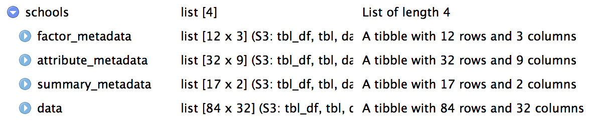

```{r setup, echo = FALSE, message = FALSE, warning = FALSE}
knitr::opts_chunk$set(eval = FALSE, dpi = 72)
# devtools::install_github("ropenscilabs/icon")
library(icon) 
```

class: center, middle
background-image: url(images/metajam-hex.png)
background-size: contain

---


# Metajam
<br>
<br>
<br>
<br>
.center[.large[R package to help scientists to download datasets and their corresponding metadata to their computer and load this information into R]]

---

# Metajam-ers

### Main developers:
.large[
- Irene Steves
- Mitchell Maier
- Julien Brun
]

### Contributors:
.large[Mark Schildhauer, Peter Slaughter, Steven Chong, Dominic Muellen, Jesse Goldstein, Robyn Thiessen-Bock and Matt Jones]

---

# Problem

<br>

.large[Scientist downloading data from data repositories without downloading the metadata]


---

# Motivation

.large[
1. Access data and associated metadata simultaneously

2. Keep data and metadata bundled together

3. Simple interface for users unfamiliar with Data repositories

4. Simple output for users unfamiliar with metadata standards (e.g EML, ...)
]


---
# Simple to run
<br>
.large[

Just pass in:

 1. a data URL or DOI
 
 2. a path to a folder
]

---
# Current scope
<br>
.large[

- Download datasets from DataONE repositories using EML as metadata (KNB, ADC, PASTA/EDI)

- Focus on tabular data (csv, txt, xlsx, ...)

]

---
# Few definitions

.large[
- Data package: unit used for archiving on DataONE repositories  
  - contains metadata and data files
  - DOI issued at this level

- Dataset: a specific file used to store data (e.g. csv)
]

---
class: center
background-image: url(images/adc.png)
background-size: contain

# Data repository - Arctic Data Center

---
class: inverse, center, middle

# How does it work

---

# 2 main functions:

.large[
- `metajam::download_d1_data`  
download a specific dataset to your computer using a folder based file structure grouping data and metadata

- `metajam::read_d1_files`  
read this data structure to load both data and associated metadata into R using a named list data structure
]


---
background-image: url(images/file-structure.png)
background-size: contain

# File structure

---
class: inverse, center, middle

# Example #1

.large[Alaska school characteristics and teacher retention, 2009-2015:
https://arcticdata.io/catalog/view/doi:10.18739/A2DP3X]

---

# Downloading data

```{r metajam download, comment='#'}
# set inputs
data_obj <- "https://arcticdata.io/metacat/d1/mn/v2/object/urn%3Auuid%3A9e123f84-ce0d-4094-b898-c9e73680eafa"
path <- "~/Desktop"

# download data and metadata
library(metajam)

download_d1_data(data_obj, path)

# Returned
#[1] "~/Desktop/doi_10.18739_A2DP3X__Alaska_Schools_Rentention2009_15"
```
---
background-image: url(images/download-output.png)
background-size: contain

# Downloading data

---
background-image: url(images/downloaded-files.png)
background-size: contain

# Downloading data

---

# Wait a minute!

I could simply do:

```{r download-file, comment='#'}
# R base can do this
download.file(data_obj, "Alaska_Schools_Rentention2009_15.csv")

# or even 
my_data <- read.csv(data_obj)

```

---

# Yes, but...

.large[
`metajam::download_d1_data()` will also:

- Download the metadata

- Parse the original metadata into summary tables

- Check if this URL is still pointing to the latest version of the dataset

- Capture extra metadata:
  - When the data was downloaded
  - Associated data package URLs (DOI, ...)
]


---

# Read Files Into R

```{r read, message=FALSE}
my_data <- read_d1_files("~/Desktop/doi_10.18739_A2DP3X__Alaska_Schools_Rentention2009_15")
```

--

<br>


---

# Under the hood

.large[
`metajam` relies on two main R packages:

- `dataone`

- `EML2`
]

---
class: inverse, center, middle

# Demo

